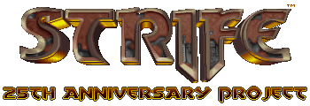

Right now there's nothing here, we haven't started yet.

### What even is this thing

When it comes to id tech 1 titles, Strife gets very little attention from the modding community, which is a shame, because it's a pretty solid game. Since the 25th anniversary of the game's release has come, I had the idea to celebrate by organizing a mapping project for it.

This project is part of the "Lords of Terror" trilogy, along with Spooktober and HeXmas (20 Heretics and Soundless Mound also play some part into this continuity, though).

### What's set for now

It will be a hub, definitely. A single player campaign, set 25 years after the ending of the original game. Long after the fall of the Order, there's news of a hostile cult having formed in a nearby city. As an elite soldier of the Front, it is your mission to combat this new threat.